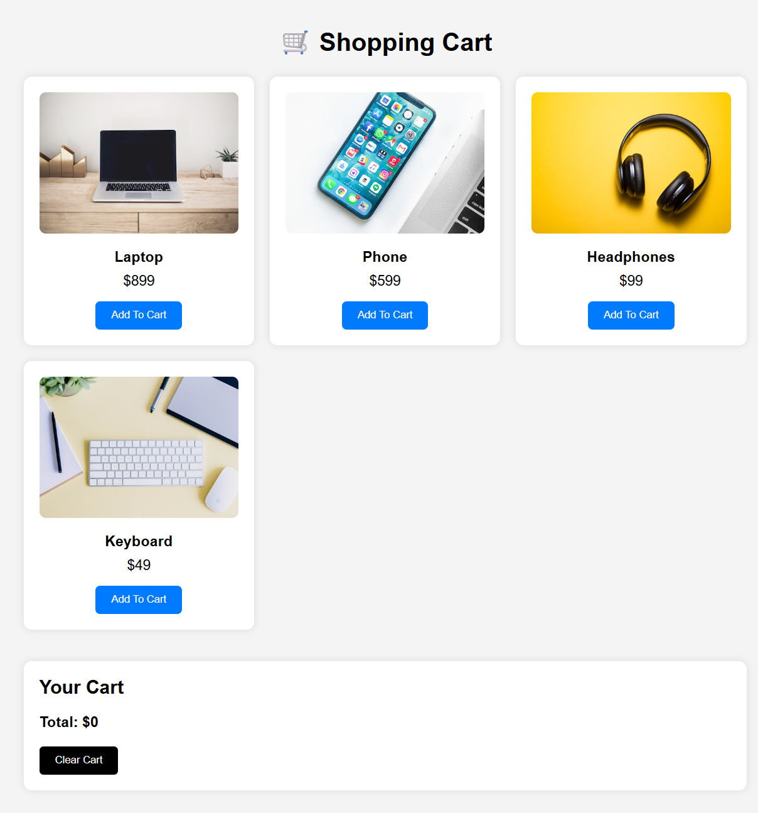

# 🛒 Shopping Cart (HTML, CSS, JavaScript)


A beginner-friendly Shopping Cart application built using vanilla HTML, CSS, and JavaScript. It demonstrates DOM manipulation, event handling, arrays, and functions without using any frameworks.

---

## Features

- Display products dynamically
- Add products to cart
- Remove individual items
- Calculate total price automatically
- Clear entire cart
- Clean responsive UI
- Well-commented source code

---

## Project Structure

```
shopping-cart/
│
├── index.html
├── style.css
├── script.js
└── images/
    ├── laptop.jpg
    ├── phone.jpg
    ├── headphones.jpg
    └── keyboard.jpg
    |__ shopping-cart.png

```

---

## 📸 Screenshot

### Shopping Cart Preview



---

## Technologies Used

- HTML5
- CSS3
- JavaScript (ES6)

---

## How to Run

1. Download or clone the project.

```bash
git clone https://github.com/ajinkya029/Shopping-Cart.git
```

2. Open the project folder.

3. Double-click `index.html` or open it with Live Server in VS Code.

---

## Learning Concepts

This project covers:

- Variables (`let`, `const`)
- Arrays
- Objects
- Functions
- DOM Manipulation
- Event Listeners
- Loops
- Template Literals
- Arrow Functions

---

## Future Improvements

- Store cart using Local Storage
- Quantity increment/decrement
- Product images
- Search functionality
- Product categories
- Checkout page
- Discount coupons
- Responsive animations
- Dark mode

---

## License

This project is free to use for learning and educational purposes.

---

## Author

**Ajinkya Dhatrak**
